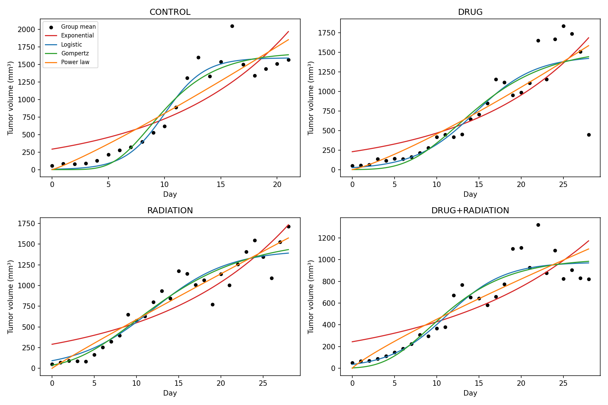
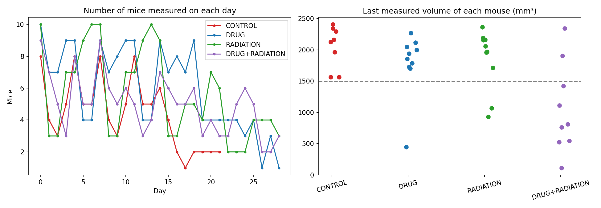

# Tumor Growth Modeling: Comparing Four Classical Growth Models

Team project by **Aryan Pathak** and **Rohit Narwal** (University of Idaho, Applied Modeling & Data Science).
Original team repository: https://github.com/rohitN04/mathematics-biology-model

**My contributions:** Checked and compared the model results across the four treatment groups, and prepared the final project presentation. In this repo I extended the original analysis with a data check (mice leaving the study), a train/test prediction test, and per-mouse model fits.

## Question
Which classical growth model (Exponential, Logistic, Gompertz, Power Law) best *describes* and best *predicts* tumor growth in mice under four treatments?

## Data
Tumor volume (mm³) for **37 mice** in four groups (Control 8, Drug 10, Radiation 10, Drug+Radiation 9), **575 measurements** over 21-28 days. Source: [CAUSE Teaching Statistics in the Health Sciences, Tumor Growth dataset](https://causeweb.org/tshs/tumor-growth/). No missing values. Mean starting volume was about 50 mm³ in every group.

## Methods
- Fit four ODE-based models to each group's mean volume per day with nonlinear least squares (`scipy.optimize.curve_fit`) using parameter bounds.
- Compared models with R², RMSE, and AIC.
- Tested prediction by fitting the first 70% of days and predicting the last 30%.
- Re-checked the conclusions by fitting each mouse individually (AICc) and by dropping days with fewer than 3 mice.

## Results
| Group | Best model by AIC | R² | AIC |
|---|---|---|---|
| Control | Logistic | 0.941 | 228.3 |
| Drug | Logistic | 0.816 | 324.8 |
| Radiation | Gompertz | 0.918 | 293.7 |
| Drug+Radiation | Logistic | 0.884 | 286.2 |

- Logistic had the best average fit (mean R² 0.887), then Gompertz (0.881). Exponential fit worst in every group.
- In the 70/30 prediction test, Logistic had the lowest error in 3 of 4 groups and Power Law in Radiation. Gompertz tended to over-predict.
- Fitting each mouse separately, no single model dominated: Exponential was best for 14 mice, Power Law for 11, Gompertz for 6, Logistic for 6.

## Limitations (what the data does not support)
- **Mice leave the study.** Most mice were last measured with tumors above 1,500 mm³, so late-day averages rest on 1-3 mice and the curves flatten partly because large tumors are gone. Estimates of carrying capacity (K) are therefore unreliable.
- **Each daily average mixes different mice,** since only 1-10 mice were measured on a given day.
- **Starting volume matters.** With V0 left free, fitted values were far from the observed ~50 mm³ and inflated growth rates. Constraining V0 changed the ranking of groups by growth rate.
- Small samples (8-10 mice per group) and no parameter confidence intervals.

## Run it
Open `tumor_growth_analysis.ipynb` in Google Colab, upload `data/tumor_growth_clean.csv`, and choose *Runtime → Run all*. Requires Python, pandas, NumPy, SciPy, and Matplotlib.

## Next steps
Mixed-effects modeling by mouse, bootstrap confidence intervals, and a time-to-threshold comparison between treatments.

## Reference
Benzekry, S., et al. (2014). Classical mathematical models for description and prediction of experimental tumor growth. *PLoS Computational Biology*, 10(8), e1003800.
